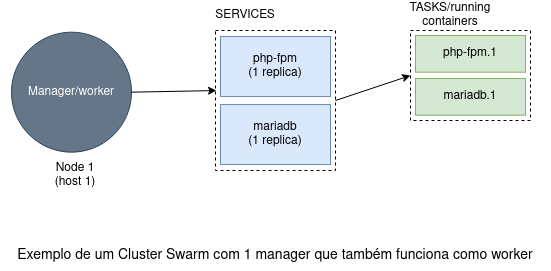

# Deploy de uma stack Swarm
### O que é o Swarm?

É uma ferramenta do próprio Docker para fazer orquestração/administração de containers em diferentes hosts. O swarm permite configurar, conectar e executar múltiplos containers em múltiplas máquinas. Isso facilita o balanceamento de carga e o escalonamento.

Alguns termos chave usados:
1. **Cluster**: aglomerado de máquinas trabalhando juntas com um propósito.
2. **Node**: é um host que executa uma Docker Engine. Existem dois tipos de nodes no swarm: Managers e Workers.
3. **Manager**: é um tipo de node que faz o gerenciamento do cluster (configurações, balanceamento, disponibilidade, criação de serviços, etc). O manager também pode trabalhar como worker.
4. **Worker**: é um tipo de node que recebe e executa tasks (containers em execução).

Neste exemplo, o manager vai criar dois serviços, o mariadb e o php-fpm. Para o mariadb, será criada uma task (1 réplica), que será distribuída entre o node2 e o node3. Já para o php-fpm será criada duas tasks (2 réplicas), que também serão distribuídas entre os nós disponíveis.

Neste outro exemplo, existe apenas uma máquina, que funcionará como manager e como worker. Ou seja, essa máquina vai criar os serviços e também vai executar todos os containers definidos.

### Como fazer o deploy local de uma stack?

Para fazer deploy em um cluster Swarm local, instale a ferramenta `pencilctl-lite`. Ela foi
desenvolvida pela Pencillabs para simplificar o deploy do projeto. Para instala-la, rode o comando:

		pip install pencilctl-lite

Com a ferramenta instalada, execute os seguintes comandos:

1. `python -m pencilctl-lite --command build --service server`.
2. `python -m pencilctl-lite --command deploy --stack transformagovrj_local`.

> O que cada um desses comandos realiza pode ser encontrado na documentação do `pencilctl-lite`.

Após o segundo comando, os serviços da aplicação serão criados. Para verificar se estão rodando
corretamente, é possível acompanhar o log do servidor pelo comando:

		docker service logs -f transformagovrj_local_server

No ambiente local, a aplicação responderá no domínio `http://local.transformagov.com`. Em
distribuições Linux, é possível criar um domínio local alterando o arquivo `/etc/hosts`. Inclua
a seguinte linha no arquivo:

	127.0.0.1 local.transformagov.com

Agora é possível acessar a aplicação na url `http://local.transformagov.com:8081`.

	

