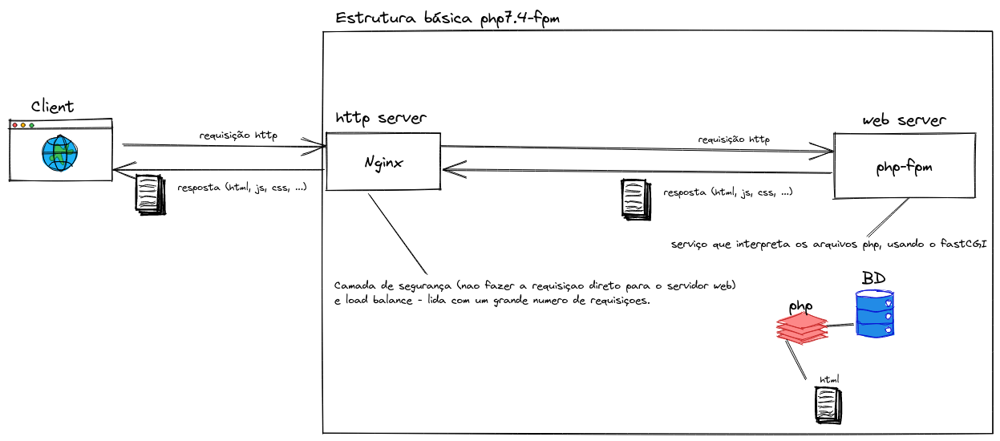
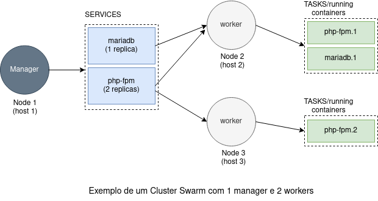

Bem vinda ao projeto TransformaGov. O TransformaGov é uma Plataforma criada a partir 
do projeto [Transforma Minas](https://github.com/seplagmg/transforma_minas), 
uma plataforma de recrutamento baseada no mérito.

A criação do projeto TransformaGov foi motivada pelos seguintes objetivos:

1. Levar o case de sucesso do projeto Transforma Minas para outros Estados e
Municípios;
2. Criar uma marca que seja independente do Estado de Minas Gerais e de mandatos específicos;
3. Construir uma comunidade de software livre ao redor do TransformaGov, que possa decidir email conjunto os rumos do projeto;
4. Evoluir o código da plataforma priorizando qualidade, testabilidade e estabilidade;


# Subindo a plataforma via Docker no ambiente local

Aqui Você encontrará as instruções para subir o sistema em um ambiente local.
Utilizamos  a ferramenta Docker para automatizar parte do processo de  disponibilização do ambiente de desenvolvimento.
Essa documentação foi homologada em um ambiente Debian 10. 
Para outros ambientes o desenvolvedor irá precisar adaptar alguns dos passos e dependências utilizadas.

1. Instale a ferramenta [docker-compose](https://docs.docker.com/compose/install/)
2. Execute o comando `make run`

Este comando irá realizar as seguintes operações:

- Construir a imagem do servidor, instalando as dependências necessárias. Essa imagem utiliza como base o Debian estável;
- Subir um container chamado `transformagov_server_1`, utilizando a imagem construida anteriormente.  
Esse container irá atuar como o servidor, e via nginx irá responder às requisições HTTP e servir os
arquivos estáticos (js, css, imagens). Além de servir os arquivos estáticos, o nginx também será 
responsável por servir os scripts PHP.
- Subir um container chamado `transformagov_db_1`, utilizando a imagem mariadb:latest.  
Esse container será o banco de dados da aplicação.

3. Restaure schema do banco utilizando o comando `make load-schema`;
4. Crie os usuários  `make create-users`;
5. Acesse a plataforma em `http://localhost:8080` ou utilize outra porta. Para isto, altere a variável do ambiente local `PORT` no arquivo `.env` com a porta desejada. Em caso de mudança da variável `PORT`, é necessário executar o comando `make up` novamente;
6. Realize login utilizando um dos usuários listados na sessão [Usuários](##usuários).

## SMTP

Tanto o cadastro de usuário, quanto a recuperação de senha dependem de disparos de email.
O sistema está utilizando o smtp do [Mailgun](https://www.mailgun.com/) para realizar o envio de email. Como isso é uma parte
central do sistema, o desenvolvedor deve alterar as credenciais utilizadas para um servidor na qual
ele tenha controle. Não há garantia que as credenciais desse repositório irão funcionar permanentemente.


## Criptografia das senhas no banco

O CodeIgniter, framework utilizado na construção do sistema, utiliza uma biblioteca própria para criptografar
e descriptografar as senhas. O desenvolvedor pode alterar a chave de criptografia utilizada no processo alterando
a configuração `encryption_key`, no arquivo `application/config/config.php`.

## Usuário administrador

Para alterar um usuário para administrador, o desenvolvedor pode fazer isso via sql.

1. acesse o banco

	docker exec -it transformagov_db_1 bash
	mysql --password=root --user=root transforma

2. execute o script que altera um usuário para administrador

	update tb_usuarios set en_perfil='administrador' where pr_usuario=<id_do_usuario_aqui>;

## Usuários

* Perfil: admin
	- CPF: 771.194.760-76
	- Senha: usuadmin123

* Perfil: candidato
	- CPF 687.541.020-65
	- Senha: usucandidato123

* Perfil: avaliador
	- CPF: 211.013.760-66
	- Senha: usuavaliador123

* Perfil: gestor
	- CPF: 058.636.740-32
	- Senha: usugestor123


Para informações sobre como subir a plataforma manualmente, acesse [as instruções na nossa wiki](https://github.com/transformagov/transformagov/wiki/instalacao-manual);

# Testes

## Testes de Aceitação

Para rodar os testes de aceitação no ambiente local, execute o comando `make cypress`. Esse
comando irá abrir o dashboard iterativo do [Cypress](https://www.cypress.io/) 
para escrita e execução dos testes de aceitação.  
Para executar os testes o TransformaGov deve estar rodando no endereço `http://localhost:8080`.

Todo commit que é enviado para o repositório passa pelo Github Actions, um projeto do Github para 
construir *pipelines* de integração contínua e deploy contínuo. O Github Actions garente que todo
commit que entre na `main` tenha os testes de aceitação executados.

# Estrutura básica do php7.4-fpm



Nessa arquitetura o cliente vai fazer uma requisição http através de um navegador, sendo que essa requisição vai chegar primeiro em um servidor http (nesse caso o nginx), que vai tratar essa requisição e direcioná-la para um servidor web (php-fpm). O php-fpm será responsável por processar os arquivos php (regras de negócio, acesso ao banco de dados, etc) e montar um html personalizado que será retornado como resposta ao nginx usando o caminho reverso, processo conhecido como proxy reverso. Após isso o nginx vai retornar a resposta (html/images/js/…) para o cliente.

### Nginx
É um servidor http capaz de lidar com um grande volume de requisições (load balance) e também funciona como um servidor de proxy reverso. O nginx fornece uma camada a mais de segurança intermediando o acesso do cliente ao servidor web.

# Deploy de uma stack Swarm
### O que é o Swarm?

É uma ferramenta do próprio Docker para fazer orquestração/administração de containers em diferentes hosts. O swarm permite configurar, conectar e executar múltiplos containers em múltiplas máquinas. Isso facilita o balanceamento de carga e o escalonamento.

Alguns termos chave usados:
1. **Cluster**: aglomerado de máquinas trabalhando juntas com um propósito.
2. **Node**: é um host que executa uma Docker Engine. Existem dois tipos de nodes no swarm: Managers e Workers.
3. **Manager**: é um tipo de node que faz o gerenciamento do cluster (configurações, balanceamento, disponibilidade, criação de serviços, etc). O manager também pode trabalhar como worker.
4. **Worker**: é um tipo de node que recebe e executa tasks (containers em execução).



Neste exemplo, o manager vai criar dois serviços, o mariadb e o php-fpm. Para o mariadb, será criada uma task (1 réplica), que será distribuída entre o node2 e o node3. Já para o php-fpm será criada duas tasks (2 réplicas), que também serão distribuídas entre os nós disponíveis.


Neste outro exemplo, existe apenas uma máquina, que funcionará como manager e como worker. Ou seja, essa máquina vai criar os serviços e também vai executar todos os containers definidos.

### Como fazer o deploy local de uma stack?

Para fazer o deploy dos serviços será usado o arquivo docker-stack.yml, só foi preciso adicionar uma imagem para o server e mudar o DB_HOST para referenciar o serviço do banco de dados.

1. Inicializar o docker swarm:
```docker swarm init```
2. Fazer o build da imagem usando o arquivo docker-stack.yml:
```docker-compose -f docker-stack.yml build``
4. Criar e fazer o deploy da stack:
```docker stack deploy -c docker-stack.yml transforma_stack```
5. Para listar os serviços da stack:
```docker stack services transforma_stack```
6. Fazer as migrações do BD. Para isso é necessário primeiro buscar o nome do container que roda o transforma_stack_db com o comando `docker ps`. Logo em seguida:
```docker cp db/transforma.sql <DB_CONTAINER_NAME>:/tmp```
```docker exec <DB_CONTAINER_NAME> /bin/bash -c 'mysql transforma < /tmp/transforma.sql --password=root'```

Links úteis:
* https://docs.docker.com/engine/swarm/key-concepts/
* https://docs.docker.com/engine/swarm/stack-deploy/
* https://docs.docker.com/engine/swarm/how-swarm-mode-works/services/
* https://docs.docker.com/get-started/swarm-deploy/


### Como fazer o deploy em produção de uma stack?
1. Copiar a pasta do projeto para a máquina remota.
```scp -r transformagov/ admin@34.225.231.130:```
2. Acessar a máquina.
```ssh admin@34.225.231.130```
3. Instalar o Docker e o Docker Compose na máquina.
4. Inicializar o Docker.
```systemctl start docker```
```gpasswd -a $USER docker```
5. Inicializar o Swarm.
```docker swarm init```
6. Fazer o build da imagem usando o arquivo docker-stack.yml.
```docker-compose -f docker-stack.yml build```
7. Criar e fazer o deploy da stack:
```docker stack deploy -c docker-stack.yml transforma_stack```
8. Para listar os serviços da stack:
```docker stack services transforma_stack```
9. Para remover os serviços da stack:
```docker stack rm transforma_stack```
